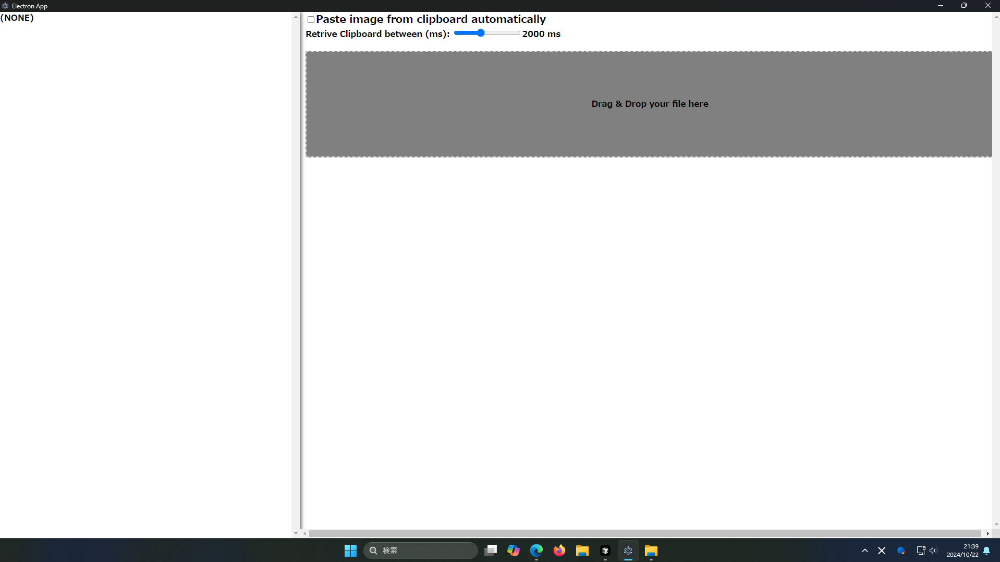
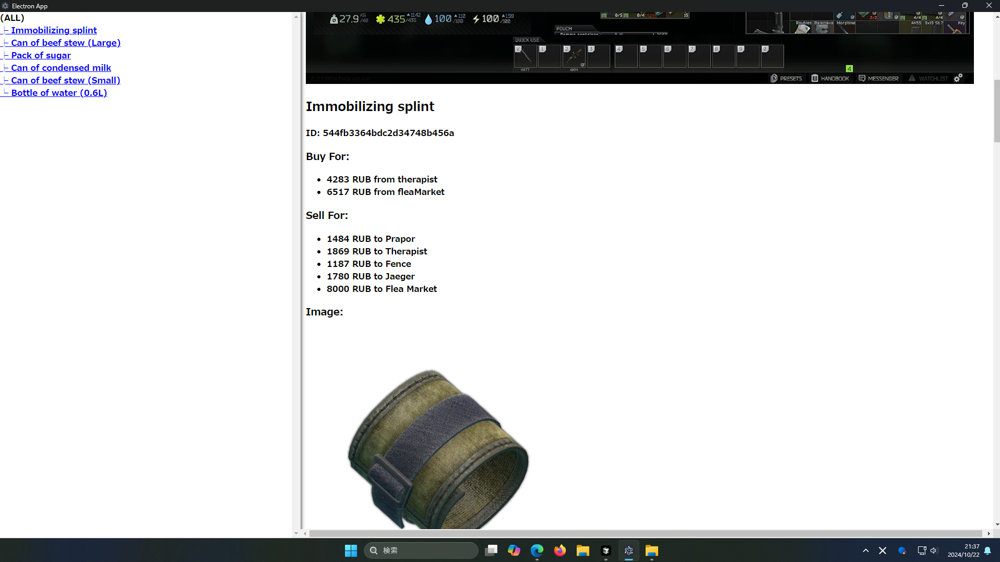

# Tarkov inventry Analyzer

## Committers
坂島悠太: Tech Lead, Engineering, Management  
大成輝: UI adjustments  
河野天星: create dataset image  
山根涼: create dataset image  
石橋怜大: create dataset image 
## About
This software and server enable users to efficiently manage their Escape from Tarkov inventory by capturing screenshots and automatically analyzing them.  
## Analyzable task items
Army bandage​  
Aseptic bandage​  
Immobilizing splint  
Bottle of water (0.6L)​  
Can of beef stew (Small)​  
Can of condensed milk  
Pack of sugar​  
Screw nut​  
Physical Bitcoin​  
## Experiment version
**Note:** This image represents an experimental version of the UI and is subject to change in the future.  
As shown in the following images, you can view details of "market value," "task demand," and "hideout demand."
After launch:  

After past and analyze image:

Result

Result2

## How to use the tool
### Server
1. You need to open the Server directory in the TarkovInventoryAnalyzer directory and start the Python file labeled `app.py`.
```bash
python app.py
```
### Application
1. You need to open the Application directory of the TarkovInventoryAnalyzer directory and install the node package.  
**Note:** If you have installed the node package once, skip this task.
```bash
npm i
```
2. Then you need to launch the application.
```bash
npm run dev
```

## Schedule plan
The entire process from image upload to displaying analysis results has been completed. However, there are still challenges with the limited number of supported items, the accuracy of item detection, and the UI design. It is expected to take several weeks to improve these aspects.
