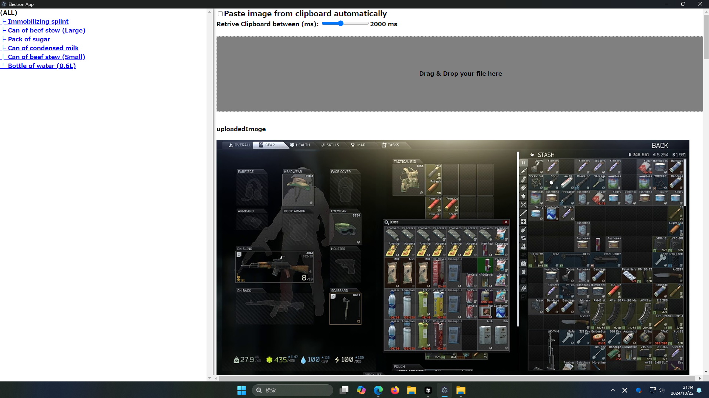
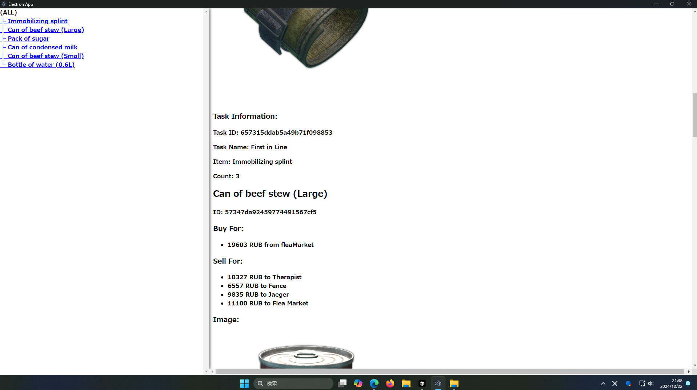

# Tarkov inventry Analyzer


## About
**Note** This program won't run without dataset that going to be downloadable at release tab in the future.  
And this repository is only a POC to see if the pattern matching process can be employed for item detection.  
But you might use this repository as framework for item detection tool.  
## Screenshot
As shown in the following images, you can view details of "market value," "task demand," and "hideout demand."  
After launch:  
```TODO: create demo video and replace this```

After past and analyze image:  

Result

Result2

## Supported items
There are only 26 items this POC can detects. But you can add items manually, easily.  
```TODO: descrive about how to add item.```
## Repository structure
```TODO: create repository structure overview```

## Instllation steps
**NOTE:** Following steps is are only valid at current experiment version.  
Note: A tutorial video is also available below.  
1. First, run this cmd to launch a server-side program.  
    ```bash
    cd Server
    pip install -r requirements.txt
    cd ../Application
    npm i
    cd ..
    ```
1. Second, download dataset from github-release tab and put like this:
```TODO: add dataset directory structure```
## Committers
坂島悠太: Tech Lead, Engineering, Management  
大成輝: UI adjustments  
河野天星: create dataset image  
山根涼: create dataset image  
石橋怜大: create dataset image 

## Schedule plan
The entire process from image upload to displaying analysis results has been completed. However, there are still challenges with the limited number of supported items, the accuracy of item detection, and the UI design.