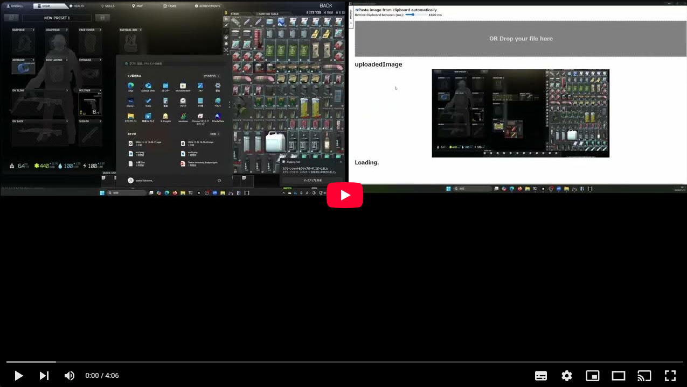

# Tarkov inventry Analyzer


## About
**Note** This program won't run without dataset that going to be downloadable at release tab in the future.  
And this repository is only a POC to see if the pattern matching process can be employed for item detection.  
But you might use this repository as framework for item detection tool.  
## Screenshot
Demo video and application description.
[](https://youtu.be/xNW-fTdD4p8)  
Demo video and application description.
This application automatically analyzes screenshots of the game “Escape from Tarkov” to extract items and display information about them.
Enable the checkbox at the top of the screen to automatically capture and analyze screenshots.
Below that, a slider allows you to set how often the clipboard is monitored, in milliseconds.
As screenshots are taken, they are automatically analyzed and information about the items found is displayed.
The information displayed includes information about in-game tasks and market value (the item's selling price).
The menu shows the time the detection was started and the items found.
This feature can also be used as a history function.
The analysis results of multiple screenshots can be saved and later switched between them.
## Supported items
There are only 26 items this POC can detects. But you can add items manually, easily.
Cut out each item in the inventory image using Paint or other editing software.
When cropping, crop the image of the item, being careful not to include the item name, weight, symbols, etc.
(*Because the value may change depending on the situation.)

## Repository structure
```bash
TarkovInventoryAnalyzer
│  readme.md -> Overview for this application.
│  References.txt -> Websites we consulted in creating this application.
│  spenits.graphql -> Query file for Tarkov API.
│
├─Application -> Application directory for launching this application.
│                      
├─POC
│      PoC.ipynb -> Proof-of-Concept for Application Server.
│      
├─resources -> Images directory in read.md file for Github.
│      
└─Server
    │  app.py -> Server required for this application.
    │  requirements.txt -> Server library required for this application.
    │  
    └─itemImages -> Image directory required for dataset.
        └─1920x1080
                Q2FuaXN0ZXIgd2l0aCBwdXJpZmllZCB3YXRlcg==.png
```

## Instllation steps
**NOTE:** Following steps is are only valid at current experiment version.  
A tutorial video is also available below.  
1. First, run this cmd to launch a server-side program.  
    ```bash
    cd Server
    pip install -r requirements.txt
    cd ../Application
    npm i
    cd ..
    ```
1. Second, download dataset from github-release tab and put like this:
```TODO: add dataset directory structure```
## Launch application steps
1. Starts the server
``` bash
    cd Server
    python3 ./app.py
```
Result 1

2. Launch another terminal
3. Launch the application
``` bash
    cd  ./Applicaiton
    npm run dev
```
Result 3

 
## Committers
坂島悠太: Tech Lead, Engineering, Management  
大成輝: UI adjustments  
河野天星: create dataset image  
山根涼: create dataset image  
石橋怜大: create dataset image 

## Schedule plan
The entire process from image upload to displaying analysis results has been completed. However, there are still challenges with the limited number of supported items, the accuracy of item detection, and the UI design.